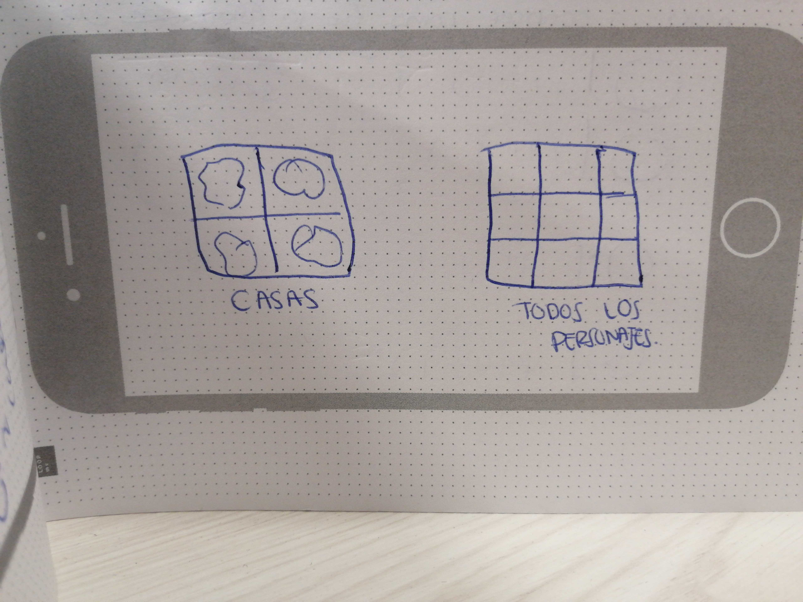

# Data Lovers

## 1. Preámbulo

“El maravilloso mundo de Harry Potter” es un proyecto de gamificación pensado y creado para reunir los conceptos basicos de la historia para introducir a cualquier persona que desconoce totalmente la tematica y pueda llevarse una idea general. Todas ellas se encuadran dentro de la narrativa del mundo mágico de Harry Potter creado por la escritora J.K. Rowling.

En este proyecto empleamos dinámicas de aprendizaje cooperativo, gamificación y diseño visual. La misión principal del proyecto es que entendiendo y pensando en las necesidades del usuario, este pueda vivir la experiencia de acceder a informacion generales de los personajes y las casas de la saga mas popular de todos los tiempos.

## 2. Resumen del proyecto

El proyecto nació, de la necesidad por descubrir la pasión por el maravilloso mundo de Harry Potter, y  darle al usuario la posibilidad de que descubrieran nuevas formas de entretenerse. Realizamos varias pruebas y errores para poder realmente descubrir cual seria la mejor informacion para brindar. Los principales usuarios de este producto son personas que no saben nada de Harry potter.El objetivo de este proyecto es darle al usuario una idea basica de Harry Potter. Los datos mas importantes que pueden ver en la interfaz son fotos generales y pequenas resenas y utilizaran el producto para conocer mas sobre el tema.
 Este proyecto mezcla la magia de los libros de la autora J.K. Rowling con los contenidos de las peliculas y muchas cosas han surgido como fruto de ideas encontradas en fuentes expertas en internet y de la participación e ideas de los propios usuarios y sus feedbacks.

## UX

### Historias de usuario

* 1.Historia de usuario # 1:
⋅⋅* Yo: Como persona que no conoce nada de Harry Potter.
⋅⋅* Quiero: Ver que informacion tiene la pagina.
⋅⋅* Para: Ver las caracteristicas basicas de Harry Potter.

### Criterios de Aceptacion:

Ilustracion de fondo, Resumen de la historia y boton continuar.

### Definicion de Hecho:

El trabajo en cada iteración tiene que cumplir con los requisitos pedidos.

* 2.Historia de usuario # 2:
⋅⋅* Yo: Como usuaria de esta pagina.
⋅⋅* Quiero: Elegir entre conocer mas sobre los personajes o sobre las casas.
⋅⋅* Para: Adentrarme mas en el tema.

### Criterios de Aceptacion:

Ilustracion de fondo, formulario e imagen de las casas con su boton  y  formulario e imagen de los personajes con su boton  y finalmente el boton regresar a la landing page.

### Definicion de Hecho:

Todo tiene que estar documentado.

* 3.Historia de usuario # 3:
⋅⋅* Yo: Como usuaria de  Harry Potter.
⋅⋅* Quiero: Saber mas sobre los personajes y sus caracteristicas.
⋅⋅* Para: Conocer a los hombres, mujeres y sus nombres por orden alfabetico.

### Criterios de Aceptacion:

Ilustracion de todos los personajes con sus nombres y boton regresar a la pagina anterior.

### Definicion de Hecho:

Todo el trabajo de todos los miembros del equipo tiene que estar totalmente integrado en cada iteración.

* 4.Historia de usuario # 4:
⋅⋅* Yo: Como usuaria de  Harry Potter.
⋅⋅* Quiero: Saber mas sobre las casas
⋅⋅* Para: Conocer sus caracteristicas principales.

### Criterios de Aceptacion:
Ilustracion de todos las casas con sus nombres, una breve explicacion de las caracteristicas de cada casa y boton regresar a la pagina anterior.

### Definicion de Hecho:

Todo el equipo considera que para cada objetivo/requisito se cumplen sus Criterios de Aceptación.

## Diseño de la Interfaz de Usuario

#### Prototipo de baja fidelidad

##### Prototipo 1

##### Prototipo 2

##### Prototipo 3

##### Prototipo 4

#### Prototipo de alta fidelidad

##### Prototipo 1

##### Prototipo 2

##### Prototipo 3

##### Prototipo 4

#### Testeos de usabilidad

Los problemas de usabilidad  que detectamos a través de los _tests_ fue que debiamos agregar botones de regresar para poder navegar por las paginas y dar opciones de volver a donde el usuario guste.
Tambien que los personajes tenian palabras de mas debajo de sus fotos, que cuando seleccionaban al personaje esperaban que sea un boton y que haga otra accion mas, lo mismo con la pantalla de casas y sus diferentes images, tambien esperaban que haga algo, pero solo mostraba un resumen de lo que era cada casa.
 Lo que mejoramos en la propuesta final, fue en respuesta a los feedbacks de los usuarios, y cambiamos y eliminamos letras de las imagenes de personajes y agregamos botones para navegar facilmente por la pagina .

***
